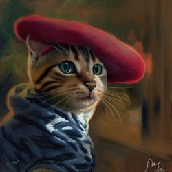

# DT-FGD – Memory-Efficient Filter-Guided Diffusion with Domain Transform Filtering :sparkles:
<a href="docs/representative_250.png">
  
</a>

A lightweight variant that replaces bilateral filtering with the efficient domain transform filter and introduces a normalization strategy for the guidance image’s latent representation.

*Memory‑Efficient **Filter‑Guided Diffusion** with Domain‑Transform Filtering*
<br clear="right"/>
---

## Requirements
- **NVIDIA GPU** with at least **12 GB VRAM** for DT-FGD and **16 GB VRAM** for original FGD at full resolution.
  (Lower-VRAM GPUs are supported with the `--decode-cpu` flag.)
  - Tested on: NVIDIA RTX 3090, RTX 3060, RTX 4060.
- **NVIDIA CUDA Toolkit** — [Download and installation guide](https://developer.nvidia.com/cuda-downloads).
- **Conda** (Miniconda or Anaconda) — not strictly required, but the provided setup and environment files are designed for it.  
  [Installation guide](https://docs.conda.io/en/latest/miniconda.html).
- **Native Linux environment** is strongly recommended.  
  WSL is not supported due to known compatibility issues with the Taichi module that may prevent execution.
  - Tested on: Ubuntu 20.04 LTS and Fedora Workstation 42

### Determinism and Cross-GPU Reproducibility

Diffusion models use iterative denoising and are sensitive to floating-point arithmetic. With fixed seeds on the **same GPU model and software stack**, runs are reproducible. **Across different GPUs or CUDA/cuDNN/driver versions, outputs can differ**, and this effect is more noticeable at higher resolutions (e.g., **1024×1024**). This stems from architecture-specific kernel selection and rounding differences in attention/convolution operations. This behavior is expected for diffusion models.

In our experiments, 1024×1024 images showed larger visual variations across GPUs
other than the RTX 3090, which was the main GPU used during the paper experiments.
For consistency, the representative `red_hat` example was selected because it
produces similar outputs across the tested GPUs.

## 1  Quick setup

```bash
git clone https://github.com/Manuel-Research-Group/DT-FGD.git
cd DT-FGD
git submodule update --init --recursive   # pulls original FGD implementation

conda env create -f environment.yml       # Torch 2.4, Diffusers 0.30
conda activate dtfgd
```

Or, using our bash script for initiating/running experiments for all test cases:

```bash
./setup_run.sh
```

---

## 2  Reproduce a paper figure

Our script produces the result of both FGD (original method) and DT-FGD (our approach). To reproduce a example, you can use the config present in the configs folder:

```bash
python run_experiment.py --dtfgd --config configs/fig7_cat_red_hat.json
```

### Script for running directly
To reproduce the representative figure from the paper (cat in a red hat), run:

```bash
./replicate_representative.sh
```

The representative image will be under `results/red_hat_dtfgd.png`

---

## 3  Run your own experiment

```bash
python run_experiment.py \
    --prompt "A Van Gogh style fox portrait in a blue headband" \
    --sigma_s 4 --sigma_r 0.25 --detail 0.8 --t_end 15 \
    --image_size 1024 1024 --guide assets/woman_blueheadband.png
```

---

## 4  Folder structure

```

DT-FGD/
├── assets/ # Example images used in configs and docs
│ ├── bread_2.png
│ ├── gauss.png
│ ├── monalisa.png
│ ├── red_hat.jpg
│ └── woman_blueheadband.png
│
├── configs/ # JSON configs for reproducing paper figures
│ ├── fig1_portrait_of_a_dog.json
│ ├── fig3_monalisa_dog.json
│ ├── fig7_cat_red_hat.json
│ ├── fig9_gauss_bird.json
│ ├── fig10_steak_bread.json
│ └── fig10_steak_bread1192.json
│
├── FilteredGuidedDiffusion/ # Original FGD submodule (MIT license)
│ ├── cbilateral.py
│ ├── diffusionModel.py
│ ├── FGD.py
│ ├── figures/
│ ├── imgs/
│ └── README.md
│
├── results/ # Generated outputs from experiments
│ ├── *_fgd.png
│ ├── *_dtfgd.png
│ └── *_comparison.png
│
├── src/ # Main implementation of DT-FGD
│ ├── diffusionModel.py # Modified diffusion pipeline
│ ├── dtFGD.py # Domain Transform–based guided diffusion
│ ├── ncdt.py # Normalized convolution domain transform
│ └── util.py
│
├── environment.yml # Conda environment definition
├── fgd_variable_resolution.patch # Patch for FGD resolution handling
├── guided_filter_dt.png # Illustration of guided filtering
├── LICENSE.txt
├── README.md
├── run_experiment.py # Main CLI entry point
└── setup_run.sh # Helper script to run all test cases
```

---

## 5  Licence

* All code in this repository is released under **MIT License**.
* See LICENSE.txt for the full text.

### Original FGD code

This project links to the reference implementation by Gu et al. at
FilteredGuidedDiffusion/, which is licensed under MIT in their repository.
The submodule retains its original copyright and license.
Please run git submodule update --init after cloning.


---

Happy experimenting :rocket:
